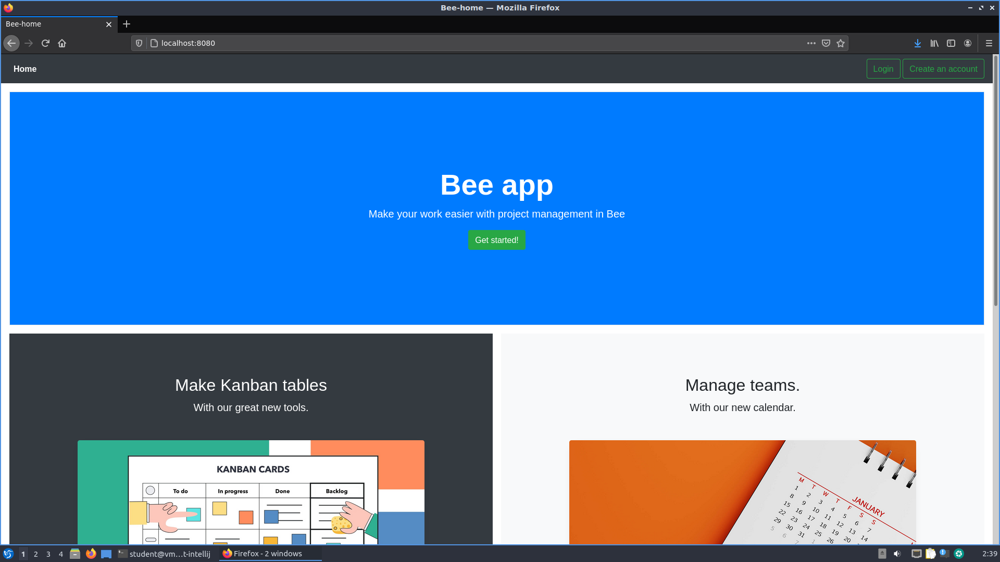
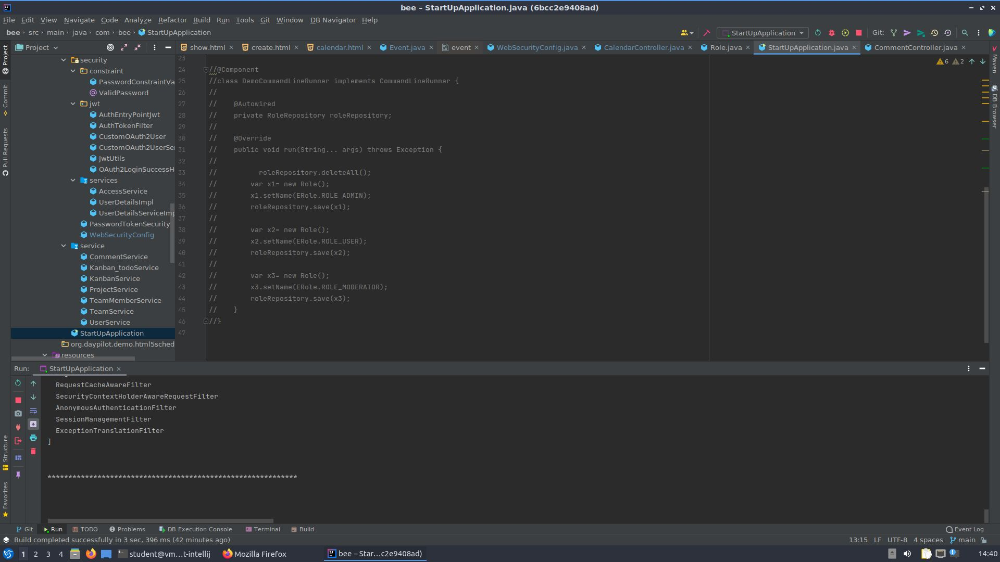

# Bee
The goal of the project is to create a simple team management application. Our application will improve the work of teams creating projects, organizing work and sharing ideas

## Table of Contents
* [General Info](#general-information)
* [Technologies Used](#technologies-used)
* [Features](#features)
* [Screenshots](#screenshots)
* [Setup](#setup)
* [Usage](#usage)
* [Project Status](#project-status)
<!--* [Room for Improvement](#room-for-improvement)-->
* [Acknowledgements](#acknowledgements)
* [Contact](#contact)
<!-- * [License](#license) -->

## General Information
The project is aimed at creating a product for companies of various sizes that need to organize work for their teams. Our tool will enable a flexible division of tasks for each team member, the ability to control the creation of projects, efficient information flow and communication between group participants. The main idea that accompanied us when creating the project was to enable the most effective remote work in the current pandemic conditions. Thanks to our application, companies will not only be able to effectively work remotely, but also facilitate the work of teams in normal office conditions.
<!-- You don't have to answer all the questions - just the ones relevant to your project. -->

## Technologies Used
- Java
- Spring Boot
- HTML
- Thymeleaf
- JavaScript
- Docker

## Features
List the ready features here:
- new user registration
- login for existing users
- creating teams and assigning users to them
- creating projects for teams
- adding comments to projects
- editing and deleting teams, projects and comments
- calendar with the ability to add events

To do:
- create kanban tables
- create a brainstorming tool
- tests

## Screenshots

Start page. To log in click Login in the top right corner. To create new account click Create an account.
<!-- If you have screenshots you'd like to share, include them here. -->

## Setup
<!-- To run our program, clone this repository to your Linux system. Then write a commands -->
Generate public SSH key and add to your github:

`ssh-keygen`

In your github account go to settings->SSH and GPG keys->New SSH key->paste your SSH key and click add SSH key.
Now go to IncorporateUS/Intellij_Docker repository to clone it and paste to your terminal:

`git clone git@github.com:IncorporateUS/Intellij_Docker.git`

Type the commands:

`cd Intellij_Docker/root-intellij`

`./install.sh`

`./start.sh`

In the Intellij start window click Customize->All settings->Apperance & Behavior->System Settings->Passwords->In keePass->OK.
Then click Projects->Get from VCS->Git Hub->Use token... Now in your github account go to Settings->Developer settings->Personal access tokens->Generate a personal access tokens.
Now select repo, workflow, gist and read:org. In note write Intellij_token, click Generate token and paste your token to Intellij and click Log in.
Select IncorporateUS/bee->Clone->Trust project.

OK, let's connect to the database. In the upper right corner click DB Browser and new connection (green '+') and choose PostgreSQL. Type in the fields:

Host: `10.0.0.3`

User: `postgres`

Password: `test123`

Click OK. Now we should be connected to the database.

In the upper left corner, expand the tab Project if neccesary, then expand bee->src->main->java->com.bee and double click StartUpApplication. Now in the top menu click Run->Run 'StartUpApplication'. After a few seconds the application should start.
To see a working application, start the browser and search for the address:

`http://localhost:8080`

The page looks like in [Screenshots](#screenshots)

All steps are covered in detail in this [video](./img/was.mp4)

## Usage
To log in click Login in the top right corner on start page. To create new account click Create an account.
- if you already have an account, log in by entering your username and password
- if you create a new account, enter any username, your e-mail address and password twice. Password should have:
  - from 8 to 30 characters
  - at least one upper case character
  - at least one lower case character
  - at least one digit
  - at least one special character
  - no whitespaces
- if you are the first user you will get administrator rights

Note:
If you are logging in for the first time go to bee/src/main/java/com.bee/StartUpApplication and uncomment lines 24 to 46

Now start the application and add a user via the 'Create an account' tab. When the first user is stored in the database, comment out lines 24-46 in StartUpApplication.
<!--How does one go about using it?--!>
<!--Provide various use cases and code examples here.-->

<!--`write-your-code-here`-->

## Project Status
Project is: _in progress_

<!-- ## Room for Improvement-->
<!--Include areas you believe need improvement / could be improved. Also add TODOs for future development.-->

<!--Room for improvement:--!>
<!--- Improvement to be done 1-->
<!--- Improvement to be done 2-->

<!--To do:-->
<!--- Feature to be added 1-->
<!--- Feature to be added 2-->

## Acknowledgements
- This project was inspired by...
- This project was based on [this tutorial](https://spring.io/guides).
- Many thanks to our Professors.

## Contact
Created by [@IncorporateUS](https://www.incorpoateus.pl/) - feel free to contact me!
